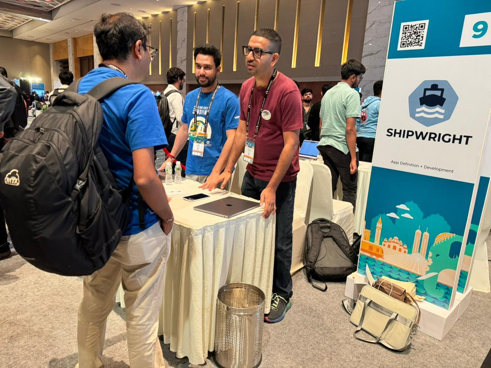

*Originally published on [Prateek's blog](https://psrvere.github.io/kubecon-india-2026-report/#booth).*

[Sayan Biswas](https://github.com/sayan-biswas) and I hosted Shipwright's first CNCF Project
Pavilion booth at KubeCon + CloudNativeCon India 2026! As a Sandbox project, we were eligible
to showcase the community's work on Friday June 19, 2026, from 11:30 AM to 1:30 PM.

<!-- truncate -->

*Sayan & Prateek at the Shipwright booth, CNCF Project Pavilion*

We hosted the table using a [booth runbook](https://psrvere.github.io/kubecon-shipwright) I had prepared. Around **80 visitors** came through in two hours. We logged **25 badge contacts** and ran a live Buildah strategy demo. The pitch was structured: why the build tool landscape is fragmented, how Shipwright unifies it, and a demo to bring it home.

## #1 question: "What is Shipwright?"

Most visitors knew Docker, many had heard of Kaniko or Buildpacks, but few knew a project unified all of them. The pitch that worked: start with the evolution. Docker had a daemon and root problem, so Kaniko and Buildah appeared. Dockerfiles were too rigid, so Buildpacks and ko appeared. Then Shipwright came along to unify all of them under one Kubernetes-native API.

## The demo that clicked

I showed how a single Build YAML decouples *what* to build from *how* to build it. Swap the strategy reference (Buildah, Buildpacks, ko) and the same source builds with a completely different tool. That decoupling was the "aha" moment for most visitors.

Having attended the Buildpacks and Jib sessions earlier made these conversations richer. When someone already understood `pack rebase` or Jib's layered model: *"Shipwright doesn't replace those tools. It gives your platform team a single API to offer all of them."*

## Who came by

BlackRock, JP Morgan Chase, Nutanix, HSBC, Eli Lilly, MassMutual, SLB, Carl Zeiss, CoverGo, and others, a strong mix of financial services, enterprise, and infrastructure companies. Several visitors expressed interest in contributing to Shipwright. We should follow up and onboard a couple of new contributors from this list.
